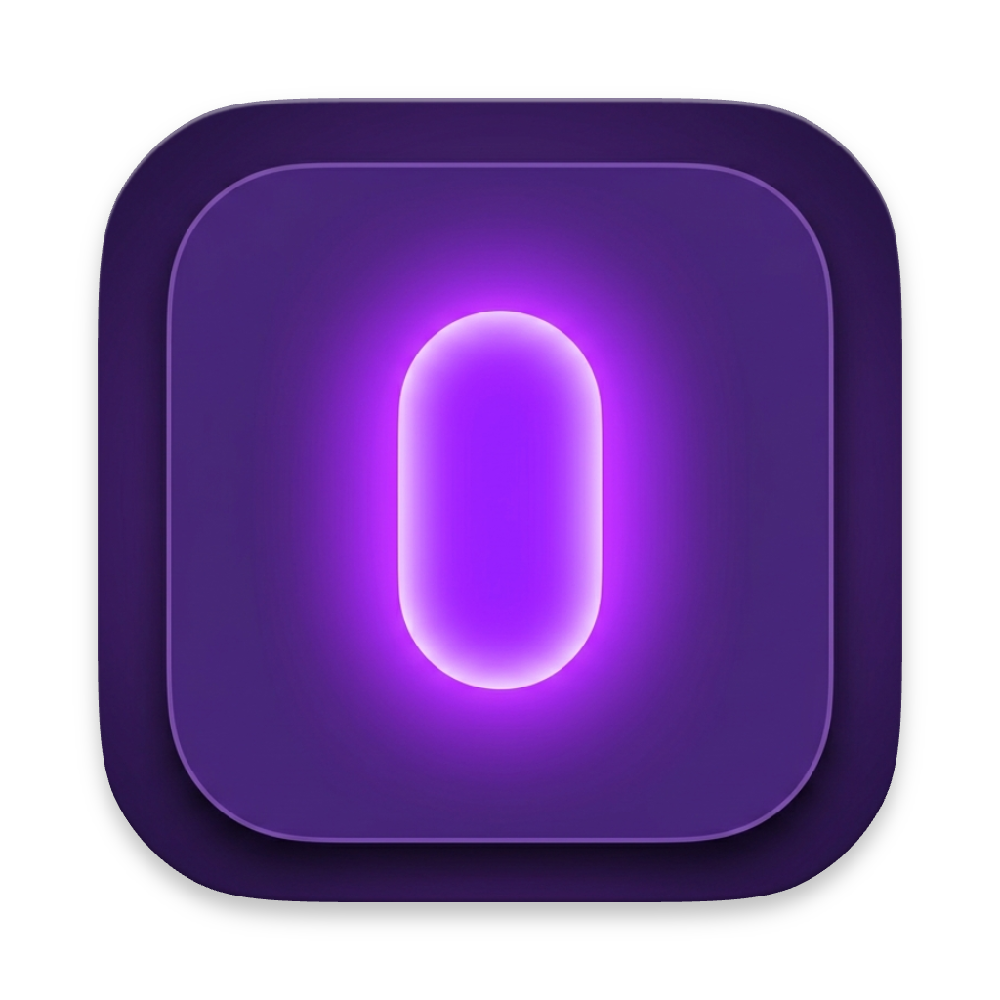

<p align="center">
  
</p>

<h1 align="center">NanoWhisper</h1>

<p align="center">
  Local, offline speech-to-text for macOS. Lives in your menubar, transcribes with <a href="https://huggingface.co/nvidia/parakeet-tdt-0.6b-v3">NVIDIA Parakeet</a>, and pastes the result wherever your cursor is.
</p>

<p align="center">
  No cloud. No API keys. No subscription. Just press a shortcut and talk.
</p>

## How it works

1. Press **⌥ Space** (customizable)
2. Speak
3. Press **⌥ Space** again
4. Text appears in your active text field + clipboard

Transcription runs entirely on-device using the Parakeet TDT 0.6B v3 model — a multilingual ASR model supporting 25 languages with automatic detection. Works great for French, English, and mixed-language input.

## Features

- **Menubar app** — no dock icon, stays out of your way
- **Global hotkey** — editable shortcut (default ⌥ Space)
- **Sound feedback** — audio cues on record start, stop, and empty transcription (toggleable)
- **History** — last 15 transcriptions with timestamps, persisted across restarts (⌘H to open)
- **Auto-paste** — transcribed text goes to clipboard and is pasted into the active field
- **Background daemon** — model stays loaded for instant re-launch
- **Auto-setup** — first launch installs everything automatically
- **Launch at login** — optional, configurable in settings

## Requirements

- macOS 13+ (Ventura or later)
- Apple Silicon (M1/M2/M3/M4)
- Python 3.10–3.12 (`brew install python@3.12`)
- ~3GB disk space (model + dependencies)

## Install

```bash
git clone https://github.com/Xavierdesousa/NanoWhisper.git
cd NanoWhisper
make app
```

On first launch, the app automatically:
- Creates a Python virtual environment at `~/.nanowhisper/`
- Installs PyTorch + NeMo
- Downloads the Parakeet model (~2GB)

This takes a few minutes. Subsequent launches are instant thanks to the background engine daemon.

## Usage

| Action | How |
|---|---|
| Start/stop recording | **⌥ Space** (default) |
| Open history | **⌘H** or Menubar → History |
| Open settings | **⌘,** or Menubar → Settings |
| Quit (keep engine alive) | Menubar → Quit |
| Quit (free all memory) | Menubar → Quit & Stop Engine |

The transcription engine runs as a background daemon. When you **Quit**, the daemon stays alive so reopening the app is instant. Use **Quit & Stop Engine** to fully shut it down.

## Permissions

The app will ask for:
- **Microphone** — to record audio
- **Accessibility** — to paste text into the active field (simulates ⌘V)

## Build from source

```bash
# Build release binary + .app bundle
make app

# Run in development (without .app bundle)
make run

# Install Python dependencies manually (optional, app does this automatically)
make setup

# Clean build artifacts
make clean
```

## Project structure

```
├── Sources/NanoWhisper/
│   ├── NanoWhisperApp.swift      # Menubar UI
│   ├── AppState.swift            # App state + recording flow
│   ├── AudioRecorder.swift       # Microphone capture (AVAudioEngine)
│   ├── Transcriber.swift         # Daemon socket client
│   ├── HotkeyManager.swift       # Global shortcut (Carbon API)
│   ├── PasteManager.swift        # Clipboard + ⌘V simulation
│   ├── SetupManager.swift        # Auto-setup on first launch
│   ├── SoundManager.swift        # Audio feedback (start/stop/error)
│   ├── SettingsView.swift        # Settings window
│   ├── HistoryView.swift         # History window
│   └── WindowUtils.swift         # Multi-screen window positioning
├── scripts/
│   ├── transcribe.py             # Transcription daemon (Unix socket server)
│   └── setup.sh                  # Python env + model setup
├── Resources/
│   ├── Info.plist
│   ├── AppIcon.icns
│   ├── start.m4a                 # Record start sound
│   ├── stop.m4a                  # Record stop sound
│   └── noResult.m4a              # Empty transcription sound
├── Package.swift
└── Makefile
```

## Sharing with friends

Just send them the repo. They need:
1. Apple Silicon Mac with macOS 13+
2. Python 3.12 (`brew install python@3.12`)
3. Run `make app`

No Apple Developer account or code signing required — the app is ad-hoc signed.

## License

MIT
